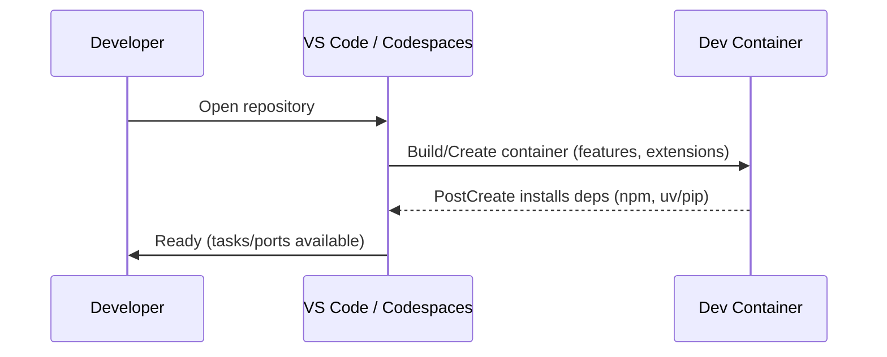
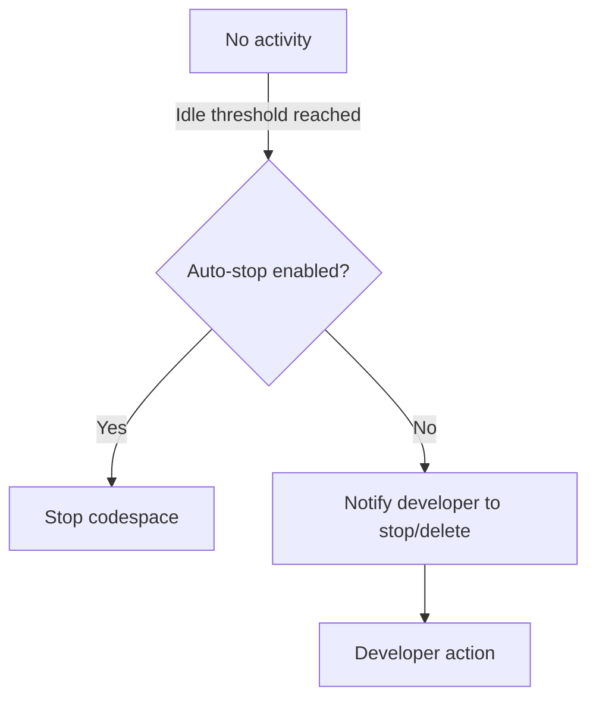

# Devcontainer Design

## Overview 
Purpose: Provide a unified, reproducible development environment via VS Code Dev Containers (local Docker) and GitHub Codespaces for the Gorgonaut monorepo (Python + JS), minimizing drift, enabling fast onboarding, and adding lifecycle and cost controls.
Users: Contributors working on ontology tooling (Python) and the web stack (JS/TS).
Impact: Introduces a standard `.devcontainer/` configuration (and Codespaces compatibility) that provisions Node.js 20 and Python ≥3.10 (pref. 3.12), installs dependencies, exposes common tasks, forwards dev ports, and supports safe shutdown to avoid orphaned resources/costs.

### Goals
- Deliver one `devcontainer.json` that runs locally and in Codespaces
- Reproducible builds and validations for Python and JS
- Lifecycle management (idle stop, clean shutdown) and cost awareness
- Clear developer tasks and minimal manual setup

### Non-Goals
- Production deployment and CI pipelines
- Secret provisioning beyond platform stores (Codespaces/OS)
- Defining billing or organization-wide Codespaces policies (documented, not enforced here)

## Architecture

### Architecture Pattern & Boundary Map
Selected pattern: “Editor-remote containerized workspace.” The editor attaches to a container that hosts the toolchains and workspace.
- Boundaries: 
  - Toolchains (Node, Python) provisioned inside container
  - Workspace mounts repo root to preserve standard layout
  - Platform-specific behavior (VS Code Dev Containers vs Codespaces) handled through devcontainer features/options and documentation
- New components:
  - `.devcontainer/devcontainer.json`
  - Optional `.devcontainer/Dockerfile` (only if features are insufficient)
  - Post-create/start commands integrating repo tasks
  - Documentation for lifecycle/cost controls in Codespaces
- Steering compliance: Aligns with monorepo structure, language versions (Node 20, Python ≥3.10), and validation tooling.

### Technology Stack
| Layer | Choice / Version | Role in Feature | Notes |
|-------|------------------|-----------------|-------|
| Frontend / CLI | VS Code Dev Containers / GitHub Codespaces | Remote dev UX | Common container config |
| Backend / Services | N/A | N/A | Local-only tooling |
| Data / Storage | N/A | N/A | Workspace bind mount |
| Messaging / Events | N/A | N/A | — |
| Infrastructure / Runtime | Debian/Ubuntu base + devcontainer features | Container runtime for tooling | Features: node, python, common-utils |

## System Flows

### Startup (Local/Codespaces)

### Shutdown/Idle (Codespaces emphasis)

## Requirements Traceability

| Requirement | Summary | Components | Interfaces | Flows |
|-------------|---------|------------|------------|-------|
| 1 | Dual environment support | devcontainer.json | VS Code / Codespaces | Startup |
| 2 | Toolchain provisioning | features, postCreate | Shell tasks | Startup |
| 3 | Workspace tasks | tasks + Make targets | Terminal tasks | Startup |
| 4 | Build & validation | postCreate/postStart | Shell tasks | Startup |
| 5 | Lifecycle mgmt | docs/notes + platform | VS/Codespaces UI | Shutdown/Idle |
| 6 | Cost controls | defaults + docs | Codespaces settings | Shutdown/Idle |
| 7 | Secrets | platform secrets | Env injection | Startup |
| 8 | DX & debugging | ports/launch | VS Code launch | Startup |
| 9 | Security defaults | least privilege | Container image | Both |

## Components and Interfaces

### Devcontainer Configuration (`.devcontainer/devcontainer.json`)
| Field | Detail |
|-------|--------|
| Intent | Define a single container config for local Dev Containers and Codespaces |
| Requirements | 1, 2, 3, 4, 6, 8, 9 |
| Contracts | State, Batch |

Responsibilities & Constraints
- Provision Node 20 and Python 3.12 via devcontainer features.
- Install JS deps (npm ci) and Python deps (uv; fallback pip) on create/update.
- Expose repo tasks (JS lib build/test; web build; Python validators).
- Forward common dev ports: 5173 (Vite), 3000 (alt web), 8000 (Python).
- Minimal privileges; avoid embedding secrets; pin feature versions.

Dependencies
- Inbound: VS Code Dev Containers/Codespaces — orchestrates lifecycle
- Outbound: OS package manager (graphviz), npm, uv/pip
- External: GHCR features registry

Contracts
- Batch (postCreate/update): install dependencies deterministically
- State: ports/paths/ENV consistent across platforms

Implementation Notes
- Use features: `ghcr.io/devcontainers/features/node:1`, `ghcr.io/devcontainers/features/python:1`, `ghcr.io/devcontainers/features/common-utils:2`.
- postCreateCommand: `(npm ci || npm i)` under `js/` and `uv pip install -e ./python || python -m pip install -e ./python && pip install -r` (align to `pyproject.toml`).
- Install `graphviz` via apt when needed for validators.
- `customizations.vscode.extensions`: Python, ESLint, Prettier, Dev Containers.
- `forwardPorts` and `portsAttributes` for 5173, 3000, 8000; set visibility in Codespaces as needed.

### Codespaces Defaults
| Field | Detail |
|-------|--------|
| Intent | Cost-aware defaults and lifecycle settings |
| Requirements | 1, 5, 6, 7, 8 |
| Contracts | State |

Responsibilities & Constraints
- Default to a small machine (2-core) via repository Codespaces settings (documented).
- Document idle timeout/retention; encourage stop/delete when finished.
- Link to pricing calculator and show cost context in docs.

Implementation Notes
- Machine size is selected in repo settings (not enforced by devcontainer). Document expected default and escalation path.
- Idle stop behavior relies on Codespaces platform; provide guidance in README/dev notes.

### Tasks and Scripts
| Field | Detail |
|-------|--------|
| Intent | One-command build/test/validate flows |
| Requirements | 3, 4 |
| Contracts | Batch |

Responsibilities & Constraints
- JS: `js/packages/lib` build/test/typecheck; `js/apps/web` build/preview.
- Python: install and run SHACL/OpenAPI validators.
- Non-interactive; exit non-zero on failure.

Implementation Notes
- Reuse `docker-compose.yml` commands as reference for scripts to mirror behavior.
- Provide VS Code tasks or npm scripts where appropriate.

## Error Handling

### Strategy
- Install failures: show failing command and remediation (proxy, cache clean).
- Missing secrets: block dependent tasks; instructions to configure.
- Port conflicts: re-map or prompt; codespaces mark visibility.
- Unsupported arch/feature: fail fast with guidance.

### Monitoring
- Rely on VS Code/Codespaces logs; consider simple healthcheck task to verify toolchain availability on start.

## Testing Strategy
- Unit: none (configuration)
- Integration (container): 
  - Devcontainer builds on Apple Silicon and x86_64
  - `npm ci && build && test` succeeds in JS workspaces
  - `uv/pip` installs and both Python validators run
  - Ports forward and dev servers accessible
- E2E: open repo → container ready → tasks succeed

## Security Considerations
- Least privilege; avoid embedding credentials.
- Pin feature versions; document update cadence.
- Secrets via platform stores only; never commit `.env`.

