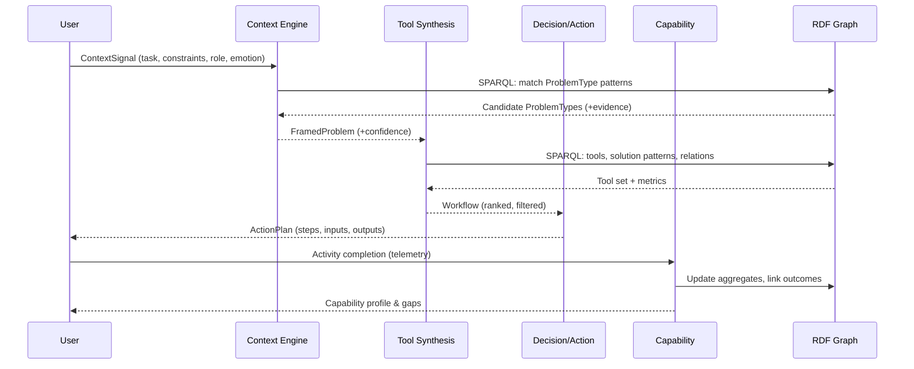

# Design Document - Expert System

## 1. Overview

This design specifies the expert system that transforms user context into actionable tool recommendations and executable workflows. It implements the four-layer architecture described in the product vision and requirements:
- Context Engine
- Tool Synthesis Engine
- Decision/Action Layer
- Capability Building Layer

Primary goals:
- Accurate context understanding and problem-type identification
- Deterministic, explainable tool/workflow recommendations
- Clear, executable action plans with inputs/outputs
- Persistent capability tracking and gap analysis

Non-functional targets:
- Typical ontology query responses under 500 ms
- Clear interfaces between layers; dependency injection for testability
- Strong typing and isolation for unit tests

## 2. Architecture

### 2.1 Component Diagram

```mermaid
flowchart LR
  A[User Context] --> CE[Context Engine]
  CE -->|Problem Types + Confidence| TS[Tool Synthesis Engine]
  TS -->|Workflow + Rationale| DA[Decision/Action Layer]
  DA -->|Activities + Outcomes| CB[Capability Building Layer]

  subgraph Ontology
    G[(RDF Graph)]
  end

  CE -->|SPARQL| G
  TS -->|SPARQL| G
  CB -->|SPARQL (aggregate)| G
```

### 2.2 Data Flow



## 3. Module Layout (Python)

Planned under `python/src/gorgonaut/engine/`:
- `context.py` — ContextEngine: parse signals, identify problem types
- `synthesis.py` — ToolSynthesisEngine: select and compose tools into workflows
- `decision.py` — DecisionActionEngine: generate executable action plans
- `capability.py` — CapabilityEngine: update/read capability profiles and gaps

Support modules:
- `ontology/graph.py` — RDF graph loading, SPARQL utilities, caching
- `types.py` — Typed data structures shared across layers
- `config.py` — Environment-driven configuration
- `errors.py` — Exception taxonomy with user-safe messages

## 4. Domain Types (typed interfaces)

```python
from dataclasses import dataclass
from typing import List, Dict, Optional, Literal

Role = Literal["individual", "manager", "consultant", "team-lead", "student"]

@dataclass
class ContextSignal:
    description: str
    constraints: Dict[str, str]  # e.g., {"time": "short", "resources": "limited"}
    role: Optional[Role]
    emotion: Optional[str]       # e.g., "stressed", "urgent"

@dataclass
class ProblemTypeCandidate:
    id: str
    label: str
    confidence: float
    rationale: List[str]

@dataclass
class FramedProblem:
    signal: ContextSignal
    candidates: List[ProblemTypeCandidate]

@dataclass
class ToolCandidate:
    id: str
    label: str
    description: str
    suitability: float
    reasons: List[str]
    metaSkills: List[str]
    problemTypes: List[str]

@dataclass
class WorkflowStep:
    order: int
    toolId: str
    toolName: str
    purpose: str
    inputsRequired: List[str]
    outputsProduced: List[str]
    dependsOn: List[int]

@dataclass
class Workflow:
    steps: List[WorkflowStep]
    rationale: List[str]

@dataclass
class ActionPlan:
    steps: List[Dict[str, str]]  # concrete, user-facing instructions
    artifacts: List[str]
    notes: List[str]

@dataclass
class CapabilityProfile:
    userId: str
    proficiencyByMetaSkill: Dict[str, float]
    gaps: List[Dict[str, str]]
```

## 5. Layer Designs

### 5.1 Context Engine
Responsibilities:
- Normalize `ContextSignal`
- Map free-text description to ontology `ProblemType` instances
- Score and rank candidates with transparent rationale

Key operations:
- SPARQL queries across labels, comments, synonyms
- Optional TF-IDF/BM25 over cached labels/comments (phase 2)
- Heuristics: role/emotion/constraints adjust prior weights

Correctness properties:
- Determinism given identical inputs and ontology state
- Confidence scores in [0, 1], sum not required to be 1
- Rationale must include query fragments or matched features

### 5.2 Tool Synthesis Engine
Responsibilities:
- Retrieve `Tool` candidates linked to top `ProblemType`(s)
- Rank by suitability (coverage of constraints, role relevance, outcomes)
- Compose multi-step workflows when multiple patterns are needed

Key operations:
- SPARQL traversal: ProblemType → SolutionPattern → Tool
- Suitability scoring: weighted linear combination
  - Problem-type match weight
  - Constraint compatibility (time/resources/skill)
  - Role relevance
  - Outcome coverage
- Composition:
  - Topologically sort by dependencies and typical usage sequence
  - Merge redundant steps, ensure input/output continuity

### 5.3 Decision/Action Layer
Responsibilities:
- Convert workflow into user-facing ActionPlan
- Expand each step into concise, verifiable instructions
- Enumerate required inputs and produced artifacts

Key operations:
- Instruction templates per tool type
- Examples and pitfalls section (if available)
- Export-friendly structure (for API/UI)

### 5.4 Capability Building Layer
Responsibilities:
- Record workflow completions and practiced meta-skills
- Update proficiency aggregates and detect gaps
- Recommend tools/workflows for gap closure

Key operations:
- Aggregate counters by meta-skill
- Simple exponential moving average for progression
- Gap = target - current; prioritize by product principles

## 6. Ontology & SPARQL Integration

Graph:
- Load once at startup (config path); reuse across engines
- Validate with SHACL on boot (optional in dev)

SPARQL utilities:
- Parameterized queries with safe interpolation
- Caching layer (read-through, size/time bounded)

Example query stubs:
```sparql
# ProblemType candidates by keyword
SELECT ?pt ?label ?score WHERE {
  ?pt a :ProblemType ;
      rdfs:label ?label ;
      rdfs:comment ?comment .
  FILTER(CONTAINS(LCASE(?label), LCASE(?q)) || CONTAINS(LCASE(?comment), LCASE(?q)))
  BIND(0.7 AS ?score)  # placeholder; real score computed in Python
}
LIMIT 25
```

## 7. Configuration & Environment

Use `gorgonaut.config`:
- `ONTOLOGY_PATH` (required)
- `CACHE_MAX_ITEMS` (default 1000)
- `CACHE_TTL_SECONDS` (default 300)
- `LOG_LEVEL` (default INFO)

Dependency injection:
- Engines accept `graph`, `config`, and `logger` interfaces in constructors

## 8. Error Handling

Exception taxonomy:
- `InvalidInputError` — malformed/empty context
- `OntologyUnavailableError` — graph not loaded
- `NoMatchesFound` — suggest broadening search
- `InternalEngineError` — unexpected failures (log with context)

User-facing errors:
- Clear messages without internal details
- Include suggested next steps or alternatives

## 9. Performance & Caching

- Warm critical indexes on startup (labels, problem-type lookup)
- Cache SPARQL result sets for frequent queries
- Target: typical request under 500 ms; include metrics hooks

## 10. Testing Strategy

Unit tests (per engine):
- Mock `graph` and assert deterministic outputs given fixtures
- Boundary tests for empty/ambiguous inputs

Integration tests:
- Load small ontology fixture; validate end-to-end flow
- Verify SHACL passes on fixture data

Property-based tests:
- Context parsing invariants (never raise on benign input)
- Ranking stability under score perturbations

## 11. Traceability

Mapping highlights from requirements to design:
- Context parsing and problem identification → Context Engine (5.1)
- Tool ranking and workflow composition → Synthesis (5.2)
- Actionable plans with inputs/outputs → Decision/Action (5.3)
- Capability tracking and gap analysis → Capability (5.4)
- SPARQL usage, caching, and performance budget → 6, 9
- Clear interfaces and DI → 3, 7
- Error handling guarantees → 8

## 12. Open Questions (to be finalized in tasks)

- Weight calibration methodology for suitability scoring
- Minimal ontology subset required for MVP
- Telemetry schema for capability tracking persistence


