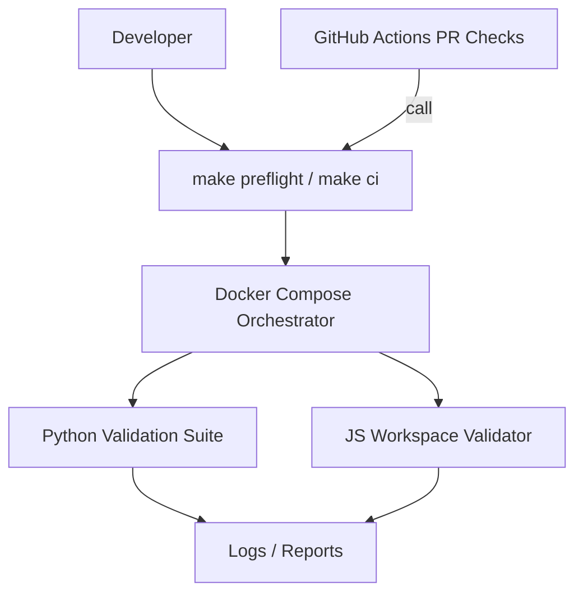
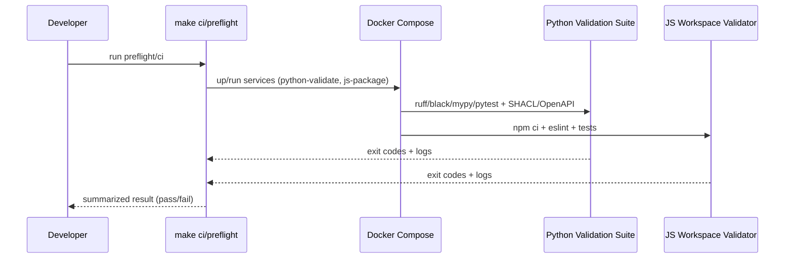

# Design Document

## Overview 
This feature guarantees reliable PR checks by enforcing local execution parity with GitHub CI. Contributors run the same checks locally—via Makefile targets and containerized services—that CI executes in workflows. The design standardizes a Makefile-first contract, wraps it with Docker Compose for determinism, and allows optional local execution through a GitHub Actions runner wrapper while keeping Actions jobs thin and delegating to Make.

### Goals
- Ensure local preflight yields the same pass/fail result as PR CI.
- Provide deterministic, containerized environments for Python and JS tasks.
- Centralize checks in Make targets to eliminate duplication.

### Non-Goals
- Implementing new business logic or app features.
- Replacing GitHub Actions entirely; local runner is optional convenience.
- Building a full devcontainer here (documented for future alignment).

## Architecture

### Existing Architecture Analysis
- The repo defines `make ci` consolidating Python (ruff, black, mypy, pytest), spec validation (SHACL, OpenAPI), and JS (install, lint, test).
- `make ci-docker` suggests Docker Compose services (e.g., `python-validate`, `js-package`), to be standardized for deterministic runs.

### Architecture Pattern & Boundary Map


**Architecture Integration**
- Selected pattern: Makefile-first contract with containerized execution.
- Domain/feature boundaries: Orchestration (Make/Compose), Validation suites (Python/JS), CI integration (workflows).
- Existing patterns preserved: Monorepo Make targets; Python via `uv`, JS via npm workspaces.
- New components rationale: Compose orchestrator to unify system deps; optional local Actions runner wrapper for convenience.
- Steering compliance: Strong typing, contract-first, reproducibility.

### Technology Stack

| Layer | Choice / Version | Role in Feature | Notes |
|-------|------------------|-----------------|-------|
| CLI | Make (GNU make) | Canonical CI/preflight entrypoints | `make ci`, `make ci-docker` |
| Container Runtime | Docker, Docker Compose v2 | Deterministic env, service orchestration | Provide images with system deps (e.g., graphviz) |
| Python Tooling | uv, ruff, black, mypy, pytest | Lint/type/test and validators | Versions pinned via `uv sync --extra dev` |
| JS Tooling | Node 20.x, npm 10, ESLint | Lint/test/build | `npm ci` for lockfile integrity |
| Optional | Local Actions runner | Convenience wrapper | Keep Actions jobs thin; call Make |

## System Flows

### Preflight (Local)


## Requirements Traceability

| Requirement | Summary | Components | Interfaces | Flows |
|-------------|---------|------------|------------|-------|
| 1 | Local parity for GH Actions workflows | Makefile, Orchestrator | Preflight service | Preflight |
| 2 | Containerized deterministic tooling | Orchestrator, Py/JS suites | Batch/Job contracts | Preflight |
| 3 | Reliable PR checks via preflight | Makefile, CI Workflows | Preflight service | CI triggers |
| 4 | Docs and artifacts | Makefile, Docs, Orchestrator | Artifact paths | Preflight |

## Components and Interfaces

### Orchestration Layer

#### PreflightService
| Field | Detail |
|-------|--------|
| Intent | Provide a single entrypoint mapping to CI-required checks |
| Requirements | 1, 3 |

**Contracts**: Service [x] / API [ ] / Event [ ] / Batch [x] / State [ ]

##### Service Interface
```typescript
interface PreflightService {
  run(context: "pr" | "push" | "local"): Promise<{
    success: boolean;
    summaryPath: string;
    artifactPaths: string[];
  }>;
}
```
- Preconditions: Repo dependencies installed or containers available.
- Postconditions: Exit code reflects success; artifacts written to known paths.
- Invariants: Calls the same underlying Make targets as CI.

##### Batch / Job Contract
- Trigger: Developer command or CI job.
- Input / validation: Workspace; optional context selection (PR vs push).
- Output / destination: Logs at `./artifacts/*`, junit/coverage (when available).
- Idempotency & recovery: Re-runnable; containers rebuilt only on Docker cache miss.

### Validation Suites

#### PythonValidationSuite
| Field | Detail |
|-------|--------|
| Intent | Execute ruff, black check, mypy, pytest, SHACL, OpenAPI |
| Requirements | 2, 3 |

**Dependencies**
- Inbound: PreflightService — orchestration (P0)
- External: uv toolchain, system deps (graphviz) (P0)

**Contracts**: Service [x] / API [ ] / Event [ ] / Batch [x] / State [ ]

##### Service Interface
```typescript
interface PythonValidationSuite {
  lint(): number; // exit code
  typecheck(): number;
  test(): number;
  validateSpecs(): number; // SHACL, OpenAPI
}
```

#### JSWorkspaceValidator
| Field | Detail |
|-------|--------|
| Intent | Run npm ci, eslint, and package tests |
| Requirements | 2, 3 |

**Contracts**: Service [x] / API [ ] / Event [ ] / Batch [x] / State [ ]

##### Service Interface
```typescript
interface JSWorkspaceValidator {
  install(): number;
  lint(): number;
  test(): number;
}
```

### Documentation & Artifacts

#### DocumentationPublisher
| Field | Detail |
|-------|--------|
| Intent | Provide contributor docs with deterministic commands and artifact locations |
| Requirements | 4 |

**Implementation Notes**
- Integration: Link `make ci` / `make ci-docker` in README and devcontainer docs.
- Validation: Ensure artifact paths exist and are uploaded by CI (when configured).
- Risks: Divergence if Actions jobs duplicate logic—mitigate by delegating to Make.

## Data Models

### Domain Model
- Concerns: Validation runs (jobs), logs, artifacts, pass/fail state.

### Data Contracts & Integration
- Artifact schemas: junit (optional), coverage reports, lints.
- API transport not applicable; file-based artifacts only.

## Error Handling

### Error Strategy
- Fail fast on tool install or runner invocation errors; produce actionable messages.

### Error Categories and Responses
- User Errors (4xx-equivalent): Missing Docker/uv → guidance and install links.
- System Errors (5xx-equivalent): Docker daemon issues → retry guidance; network failures → fallback/timeout.
- Business Logic Errors (422-equivalent): Lint/type/test failures → summarize violations.

### Monitoring
- Local: concise summaries; CI: upload artifacts for annotation.

## Testing Strategy
- Unit: Make targets invoke correct underlying commands (where scripted).
- Integration: `make ci` end-to-end locally and within Compose.
- E2E: CI workflow (when added) calls `make ci` and verifies artifact presence.
- Performance: N/A; ensure parallelizable steps do not break determinism.

## Optional Sections

### Security Considerations
- No secrets required; if needed, rely on platform secret stores in CI, not local by default.

### Performance & Scalability
- Keep images slim to reduce build time; cache dependencies where safe.

### Migration Strategy
- When adding `.github/workflows/*`, ensure jobs call Make targets and publish artifacts.


